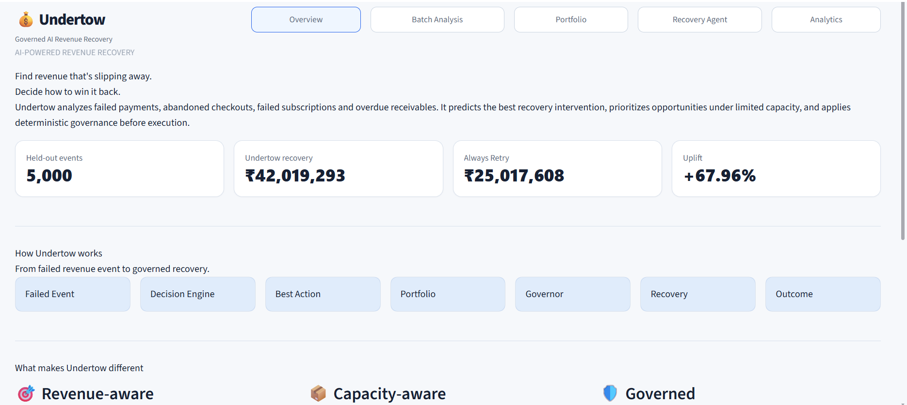
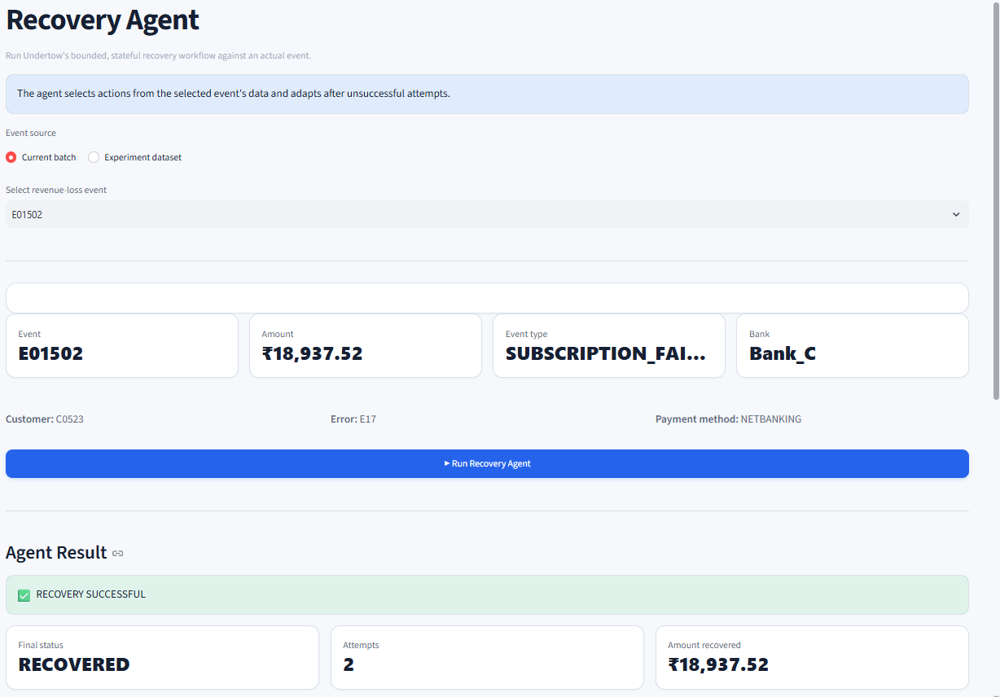
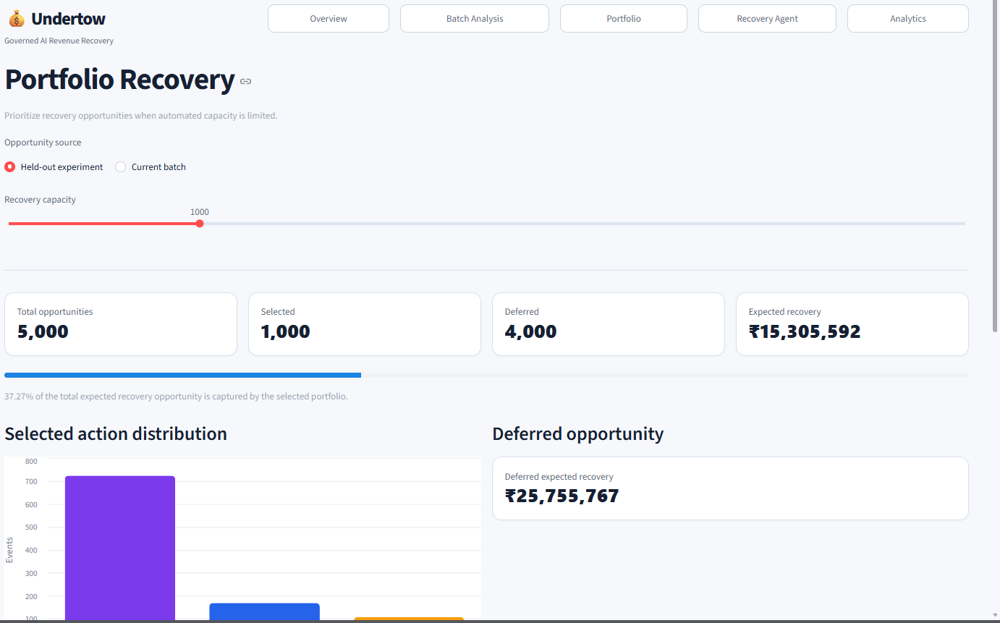
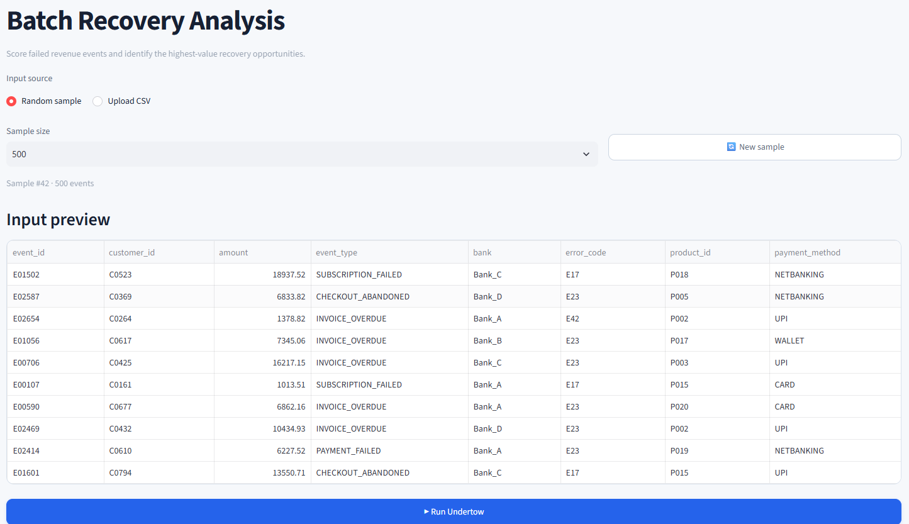
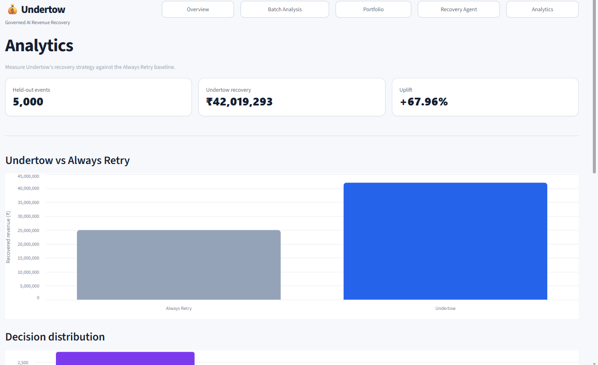

# Undertow

**Governed AI Revenue Recovery**

Undertow decides which failed payments, abandoned checkouts, and overdue invoices are worth recovering, picks the right intervention for each one, and enforces hard limits on how far automation is allowed to go — with every decision logged and explainable.

---

## Results

**Held-out test · 5,000 events**

| Metric | Undertow | Always Retry |
|---|---:|---:|
| Revenue recovered | ₹42,019,293 | ₹25,017,608 |
| Uplift | **+67.96%** | — |

---

## The Problem

Revenue doesn't slip away in one clean step. A payment fails, a checkout gets abandoned, a subscription fails, or an invoice goes overdue.

A simple recovery system may respond to every event the same way — retry everything and hope something works. That wastes recovery capacity on low-value opportunities and gives little explanation for why a particular action was taken.

Undertow treats recovery as a **decision, prioritization, and governance problem**.

---

## What Undertow Does

For every failed revenue event, Undertow:

1. **Predicts** the recovery probability of three interventions using an XGBoost model:
   - `RETRY_PAYMENT`
   - `SEND_REMINDER`
   - `ALTERNATE_PAYMENT`

2. **Scores** each option using expected recovery:

   ```
   Expected Recovery = Recovery Probability × Amount
   ```

3. **Prioritizes** opportunities across the whole batch. When recovery capacity is limited, opportunities are ranked by expected recovery and the highest-value cases are selected first.

4. **Governs** every action before execution:
   - 🟢 **ALLOW** — action satisfies the recovery rules
   - 🟠 **STOP** — expected recovery is below the minimum threshold
   - 🔴 **ESCALATE** — automated attempt limit has been reached

5. **Executes and adapts** — if an intervention fails, the agent can select another intervention within the allowed attempt limit.

6. **Logs** decisions and outcomes so automated recovery actions can be reviewed and explained.

---

## How It Works

```
Failed Revenue Events
        │
        ▼
   Decision Engine
        │
        ▼
      XGBoost
        │
        ▼
 Best Recovery Action
        │
        ▼
Portfolio Prioritization
        │
        ▼
      Governor
   ┌────┼────┐
   ▼    ▼    ▼
ALLOW STOP ESCALATE
   │    │    │
   ▼    ▼    ▼
Execute Stop Human Review
   │
   ▼
Outcome
   │
   ▼
Agent State
   │
   ▼
Audit Log
```

---

## Dashboard

Undertow provides a Streamlit dashboard for exploring recovery decisions, portfolio allocation, agent execution, and analytics.



---

## Recovery Agent

The Recovery Agent is a stateful, bounded recovery workflow. If an intervention fails, Undertow can select another intervention rather than blindly repeating the same action.



**Example:**

```
Attempt 1 — ALTERNATE_PAYMENT → FAILED
Attempt 2 — SEND_REMINDER      → RECOVERED
```

Automated recovery is bounded by a maximum number of attempts. If recovery cannot be completed within the allowed attempts, the event is escalated for human review.

---

## Governance

Every automated recovery action passes through a deterministic governor.

**🟢 ALLOW**
The action satisfies the configured recovery rules.
```
Governor: ALLOW
Execution: EXECUTED
```

**🟠 STOP**
The expected recovery is below the minimum threshold.
```
Expected recovery: ₹417.21
Governor: STOP
Reason: Expected recovery is below minimum threshold.
```

**🔴 ESCALATE**
The automated recovery attempt limit has been reached.
```
Maximum attempts reached.
Final status: HUMAN_REVIEW_REQUIRED
```

The governance layer ensures that the prediction model does not have unrestricted control over recovery actions.

---

## Portfolio Optimization

Recovery capacity is limited. Undertow ranks opportunities by expected recovery and allocates available capacity to the highest-value opportunities first.



```
Recovery Opportunities
        │
        ▼
Rank by Expected Recovery
        │
        ▼
Limited Recovery Capacity
        │
   ┌────┴────┐
   ▼         ▼
Selected   Deferred
```

The portfolio optimizer reports:
- Total opportunities
- Selected opportunities
- Deferred opportunities
- Total expected recovery
- Selected expected recovery
- Deferred expected recovery
- Recovery opportunity captured

---

## Batch Analysis

Undertow can evaluate batches of revenue-loss events using generated samples or uploaded CSV data.



The batch analysis provides:
- Transaction-level predictions
- Recovery probabilities
- Expected recovery
- Recommended interventions
- Action distribution
- Top recovery opportunities

---

## Why Undertow Is Different

**Revenue-aware**
Recovery decisions consider expected recovered revenue rather than simply maximizing retry count.

**Capacity-aware**
Limited recovery capacity is allocated toward opportunities with higher expected recovery.

**Governed**
A deterministic layer can allow, stop, or escalate automated recovery actions.

**Stateful**
The agent tracks previous attempts and can adapt after unsuccessful interventions.

**Bounded**
Automated recovery operates within explicit limits instead of retrying indefinitely.

**Explainable**
Each recovery attempt exposes its prediction, governance decision, execution result, and outcome.

---

## Experiment

Undertow was evaluated against an Always Retry baseline on a held-out set of 5,000 synthetic events.



| Metric | Undertow | Always Retry |
|---|---:|---:|
| Revenue recovered | ₹42,019,293 | ₹25,017,608 |
| Uplift | **+67.96%** | — |

The experiment measures the impact of selecting recovery interventions rather than applying the same retry strategy to every event.

---

## Tech Stack

`Python` · `XGBoost` · `scikit-learn` · `pandas` · `NumPy` · `Streamlit` · `Docker`

---

## Project Structure

```
undertow-ai/
├── app/
│   ├── dashboard.py
│   ├── agent_loop.py
│   ├── decision_engine.py
│   ├── portfolio_optimizer.py
│   ├── governor.py
│   ├── recovery_service.py
│   ├── evaluate_portfolio.py
│   └── find_failure_case.py
│
├── data/
├── models/
├── policies/
├── tests/
├── screenshots/
│   ├── dashboard.png
│   ├── recovery-agent.png
│   ├── portfolio.png
│   ├── batch-analysis.png
│   └── results.png
│
├── Dockerfile
├── .dockerignore
├── .gitignore
├── requirements.txt
└── README.md
```

---

## Run with Docker

Build the image:
```bash
docker build -t undertow-ai .
```

Run the container:
```bash
docker run -d --name undertow-app -p 8501:8501 undertow-ai
```

Open **http://localhost:8501**

Check the running container:
```bash
docker ps
```

View application logs:
```bash
docker logs undertow-app
```

---

## Roadmap

Real payment-provider integrations · messaging integrations · online model monitoring · automated model retraining · cost-aware intervention selection · human-review queues · production database integration · authentication and role-based access · expanded audit and compliance controls.

---

**Undertow**

*Analyze revenue loss. Choose the right intervention. Prioritize limited capacity. Execute within deterministic boundaries.*